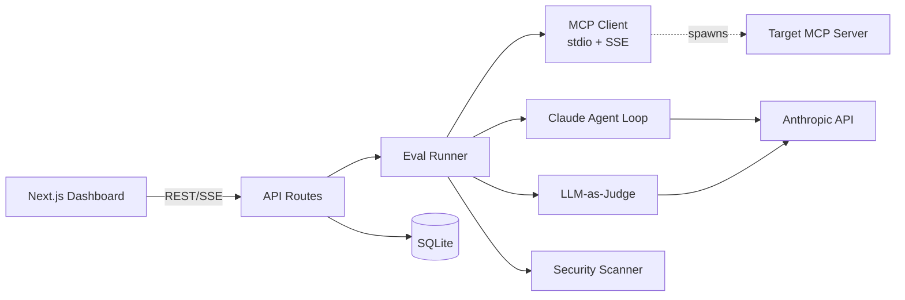

# MCP Test Bench


> **Video walkthrough:** https://youtu.be/rGaS_9dsOao
> **60-second overview:** https://youtu.be/eqE1Nj6BDIk

> Open-source evaluation harness for MCP servers: auto-discovers tools, runs LLM-judged scenarios, flags security issues, and shows traces in a web dashboard.

<!-- TODO: replace with a 5-10 second demo gif. Record with ScreenToGif on
     Windows or peek on macOS. Save to docs/demo.gif and update path here. -->


## What it is

MCP Test Bench is a local evaluation harness for [Model Context Protocol](https://modelcontextprotocol.io) servers. Point it at any MCP server — a stdio command or an SSE URL — and it discovers every tool, resource, and prompt the server exposes, then auto-generates realistic test scenarios from the schemas using Claude. It drives those scenarios through an agent loop, records every tool call and response, scores each run with an LLM-as-judge against configurable rubrics (correctness, safety, efficiency, hallucination), and audits the server for security issues such as prompt-injection patterns in tool descriptions, unbounded outputs, and PII leakage.

Everything is stored in a local SQLite file and visible in a Next.js dashboard: run history, score timelines, side-by-side server comparisons, and full trace views. A `mcpbench` CLI makes the whole pipeline scriptable for CI.

## Quickstart

```bash
git clone https://github.com/RitikPatill/mcp-test-bench.git
cd mcp-test-bench
pnpm i
export ANTHROPIC_API_KEY=sk-ant-...
pnpm dev
# open http://localhost:3000
```

Requires Node >= 20 and pnpm 9.

## Usage

Add a server through the dashboard by pasting a stdio command (e.g. `npx -y @modelcontextprotocol/server-filesystem /tmp`). Test Bench discovers its tools, auto-generates scenarios, and lets you kick off an eval with one click. The trace timeline streams live as Claude calls tools and the judge scores each turn. When it finishes, the report shows an overall score, per-rubric breakdowns, failed scenarios with reasoning, and any security findings.

For CI, build the CLI and run a config file directly:

```bash
pnpm --filter cli build
node apps/cli/dist/index.js run examples/demo/filesystem-server.yaml
```

Config files are plain YAML — see `examples/demo/filesystem-server.yaml` for the minimal shape.

## Architecture



## Project structure

```
mcp-test-bench/
├── apps/
│   ├── cli/          # mcpbench binary (tsup build → dist/index.js)
│   └── web/          # Next.js 15 App Router dashboard
├── packages/
│   └── core/         # MCP client, eval runner, judge, scanner, DB schema
├── examples/
│   ├── ci/           # GitHub Actions workflow + example config
│   └── demo/         # Ready-to-run YAML configs for public MCP servers
├── docs/             # Architecture doc, roadmap, demo gif
└── scripts/          # DB seed and demo helper scripts
```

## Roadmap

- [ ] Custom judge models — swap the judge to any OpenAI-compatible endpoint via a `judge.model` config key.
- [ ] Plugin scanners — a `ScannerPlugin` interface so community security checks can ship as npm packages.
- [ ] Hosted mode — optional Turso/libsql backend so teams can share results across machines.
- [ ] Replay mode — re-score already-saved turns without re-running the agent when rubrics change.
- [ ] Scenario library — shareable community YAML packs, one per common server type, importable via `mcpbench import`.

## License

MIT — see LICENSE.

---

Built autonomously by [autodev](https://github.com/RitikPatill/autodev),
a multi-agent orchestrator I designed. Each commit in this repo was
authored by me; the implementation work was performed by Sonnet under
the orchestrator's control. Read the orchestrator's README to see how.
