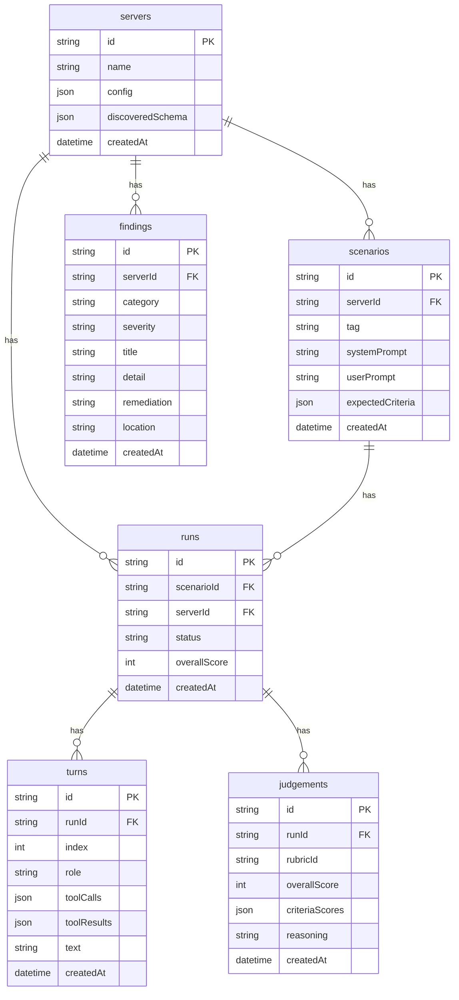

# Architecture

## 1. Module boundaries

### `mcp-client`

| | |
|---|---|
| **Path** | `packages/core/src/mcp-client/` |
| **Key exports** | `discoverServer()`, `McpSession`, `ServerConfig`, `DiscoveredSchema` |
| **Depends on** | `@modelcontextprotocol/sdk` |
| **Must not depend on** | runner, judge, scanner |

Thin wrapper over the MCP SDK. Handles stdio process spawning, SSE connection lifecycle, reconnection, and schema discovery (tools + resources + prompts).

### `runner`

| | |
|---|---|
| **Path** | `packages/core/src/runner/` |
| **Key exports** | `runScenario()`, `RunEvent` |
| **Depends on** | mcp-client, Anthropic SDK, drizzle |
| **Must not depend on** | judge, scanner |

Takes a `Scenario` row, spins up an agent loop (Claude driving the MCP client), persists every `Turn` to the database, and streams `RunEvent` objects to the caller via an async iterable.

### `judge`

| | |
|---|---|
| **Path** | `packages/core/src/judge/` |
| **Key exports** | `judgeRun()`, `Rubric`, `JudgementResult`, 4 built-in rubrics |
| **Depends on** | Anthropic SDK, drizzle |
| **Must not depend on** | runner, scanner |

Rubric evaluator. Loads a `Rubric` (built-in or custom YAML), builds a structured prompt from the run's turns, calls Claude to score each criterion, and writes a `Judgement` row.

### `generator`

| | |
|---|---|
| **Path** | `packages/core/src/generator/` |
| **Key exports** | `generateScenarios()`, `ScenarioTag` |
| **Depends on** | Anthropic SDK, drizzle |
| **Must not depend on** | runner, judge, scanner |

Calls Claude with the server's `DiscoveredSchema` and generates a set of `Scenario` rows (happy-path, edge, adversarial) for each server.

### `scanner`

| | |
|---|---|
| **Path** | `packages/core/src/scanner/` |
| **Key exports** | `scanServer()`, `Finding`, `ScannerResult` |
| **Depends on** | mcp-client, drizzle |
| **Must not depend on** | runner, judge |

Static analysis over discovered schemas (prompt-injection patterns, unbounded outputs, destructive tools) plus runtime hooks that flag suspicious content in live tool outputs.

### Web app layers

```
apps/web/src/app/api/   →  API routes (Next.js Route Handlers)
                             ↓
packages/core/           →  runner / judge / scanner / generator
                             ↓
packages/core/src/db/    →  drizzle + libsql SQLite
```

API routes are thin: they validate inputs, call core functions, and stream or return JSON. All business logic lives in `packages/core`.

---

## 2. Data model



**Score representation:**
- `runs.overallScore` — stored as 0–1000 integer; divide by 100 to display (e.g. 820 → 8.2/10).
- `judgements.overallScore` — same 0–1000 range.
- `judgements.criteriaScores` — JSON array of `{ name: string, score: number (0–100), reasoning: string }`; divide score by 10 to display as 0–10.

**Schema blob:** `servers.discoveredSchema` is a JSON column holding the full `DiscoveredSchema` object (`tools`, `resources`, `prompts` arrays) returned by `discoverServer()`.

---

## 3. Key invariants

- **Async params in Next.js 15** — all API routes and page components must `await params` before destructuring (Next.js 15 async params requirement).
- **Drizzle query builder only** — no raw SQL strings anywhere; always use the Drizzle ORM query API.
- **DB initialization** — every module that needs the DB calls `getDbReady(process.env.DATABASE_PATH ?? 'local.db')` and awaits it; never import the db instance directly.
- **SSE event broker is in-process** — `apps/web/src/lib/run-broker.ts` uses an in-memory event emitter; do not introduce Redis or external pub/sub.
- **`overallScore` integer arithmetic** — when computing or averaging scores, work in integer space (0–1000) and only divide at the presentation layer to avoid floating-point drift.
